## **Golden Gate Assembler**

### **1. Assemble three Lv0 fragments in a Lv1 Acceptor**
| Plasmid Name   | Position       | 5' Overhang | 3' Overhang | Description                             |
|----------------|----------------|-------------|-------------|-----------------------------------------|
| [pICH47732](../Genbank file/pICH47732.gb)      | Lv1 Acceptor   | GGAG        | CGCT        | Lv1 vector. Position 1.                 |
| [pICH51288](../Genbank file/pICH51288.gb)      | Lv0 Promoter   | GGAG        | AATG        | Lv0 module 2x35S promoter with Omega enhancer |
| [pMC-6-EGFP-9](../Genbank file/pMC-6-EGFP-9.gb) | Lv0 CDS        | AATG        | GCTT        | Lv0 module EGFP                         |
| [pICH41421](../Genbank file/pICH41421.gb)      | Lv0 Terminator | GCTT        | CGCT        | Lv0 module AtNOS terminator             |

1. Open the four Genbank files with ApE.

    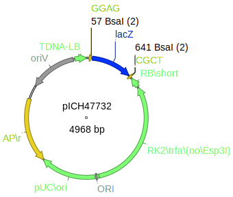
    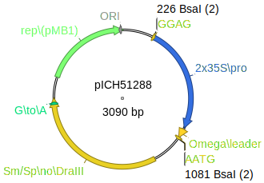
    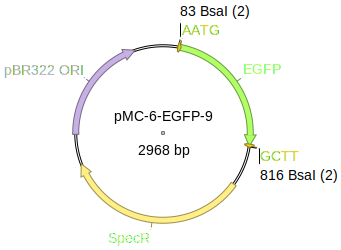
    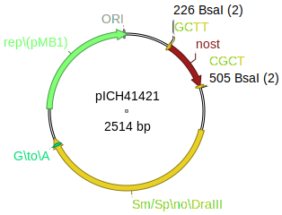

2. Open Golden Gate Assembler (Tools -> Golden Gate Assembler).

    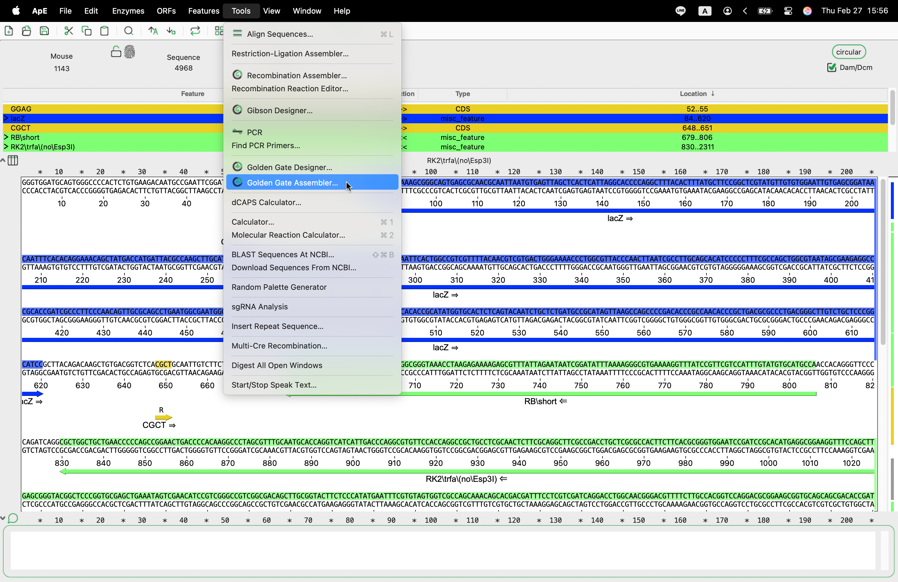
    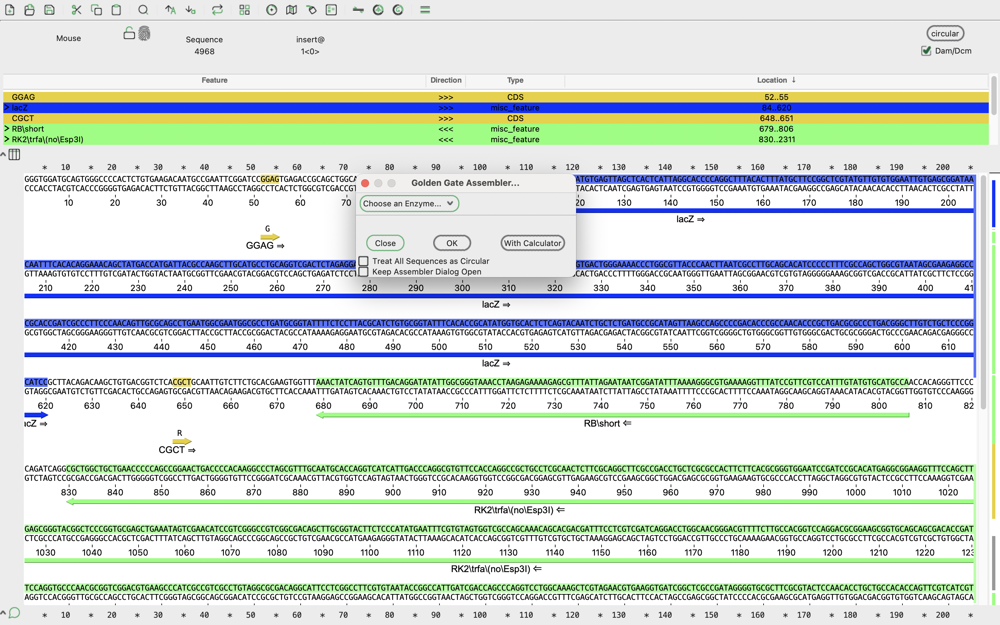

3. Select the Type IIS restriction enzyme you want to use (BsaI for assembling Lv0 fragments to Lv1 Acceptor).
       
    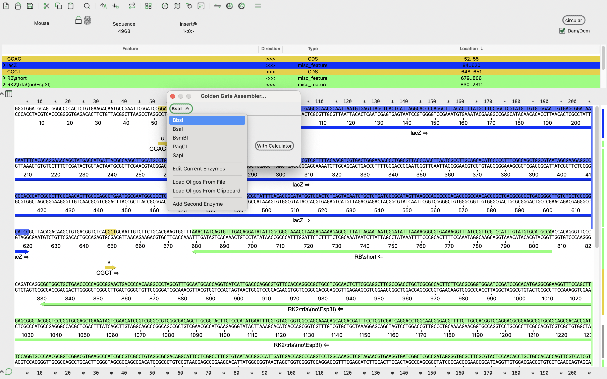

    !!! note "Note"
        * Use BbsI for assembling Lv1 modules to Lv2 Acceptor.
        * Load oligos for primer annealing (short fragment assembly [CRISPR gRNA; signal; linker; tag]).
        * Add a second enzyme (BbsI & BsaI & BsmBI) for assembling Lv2, Lv2-LacZ, and Lv2-Vio.

4. Choose the pICH47732 fragment.

    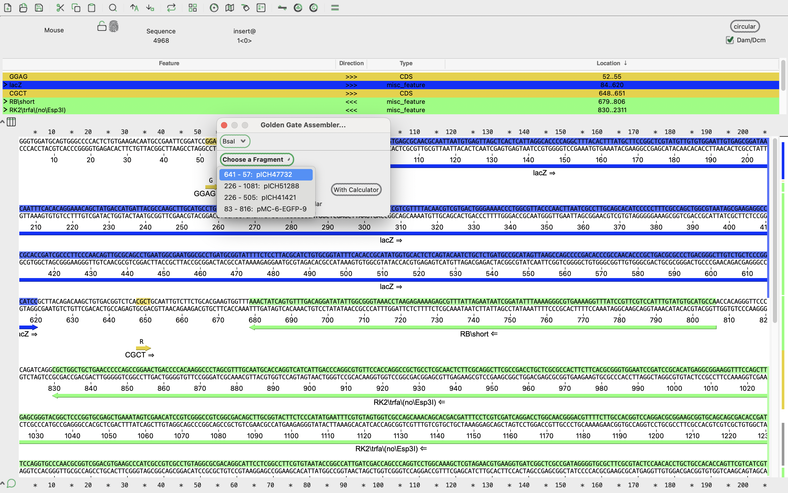

5. Click "OK" and a "[New_Golden_Gate](../Genbank file/New_Golden_Gate.gbk)" file will be generated.

    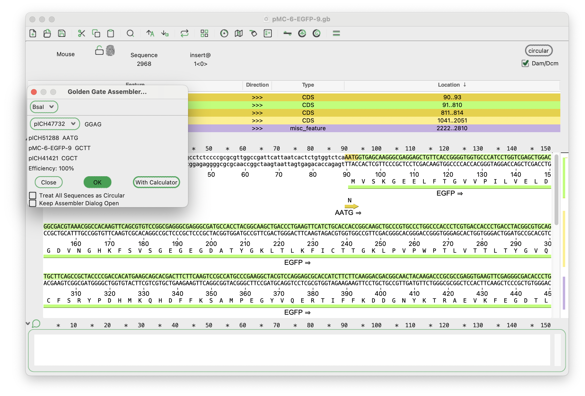

    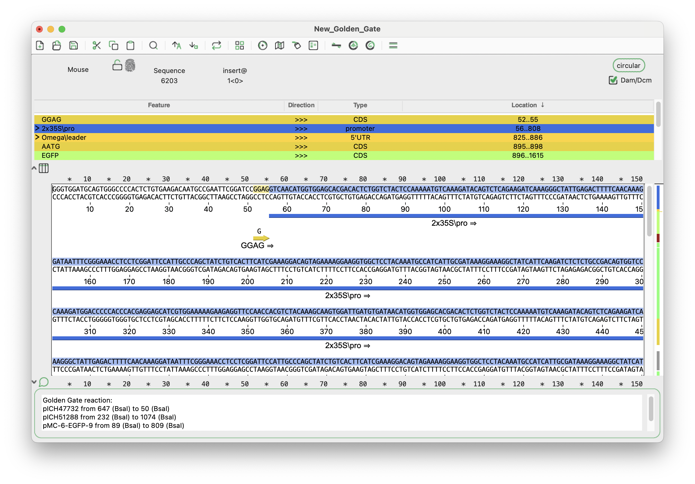

    2x35S promoter with Omega, EGFP, and AtNOS terminator are sequentailly cloned in the Lv1 Acceptor.

    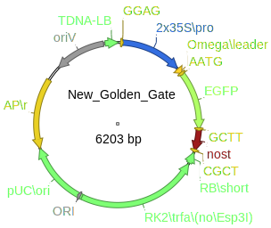

6. (Optional) Check "Treat All Sequences as Circular" and click "With Calculator".

    !!! note "In this case, every fragments are plasmids, if you are using PCR product, uncheck the bottom"

    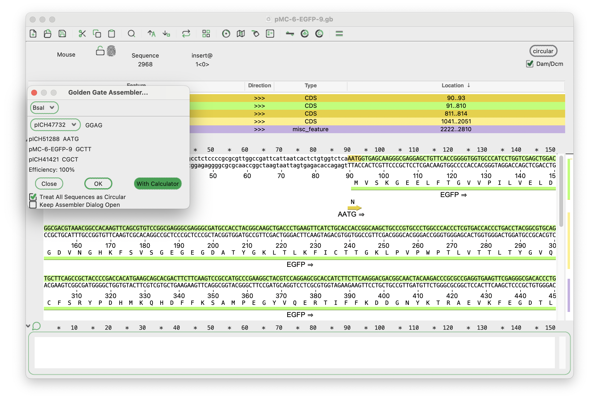

    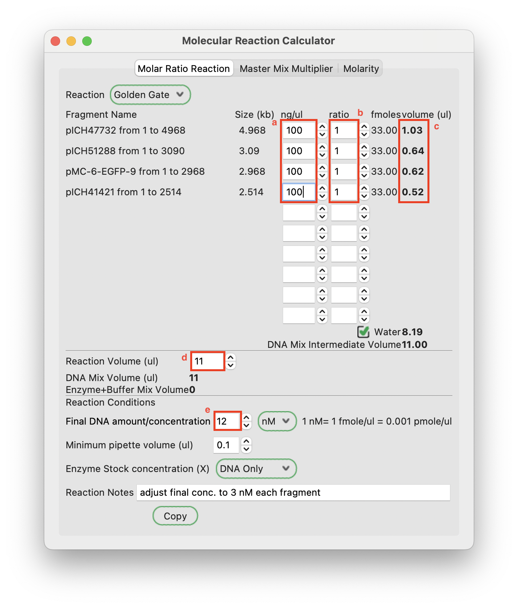

    1. Input plasmid concentration you have.
    2. Vector:Insert ratio (1:1 works for me, some people use 1:2 ratio).
    3. Exact plasmid volume for reaction.
    4. Set total reaction volume, I use 15 µl of reaction (4 µl Enzyme+Buffer & 11 µl DNA+Water).
    5. Final DNA amount/concentration (Adjust fincl concentration to 3 nM each fragment).
        * Here we have 4 fragments, therefore, 3 nM x 4 fragments = 12 nM.
    
    !!! note "You can "Copy", and paste on your notebook document"
