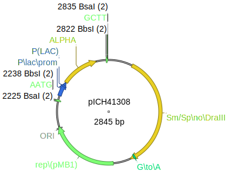
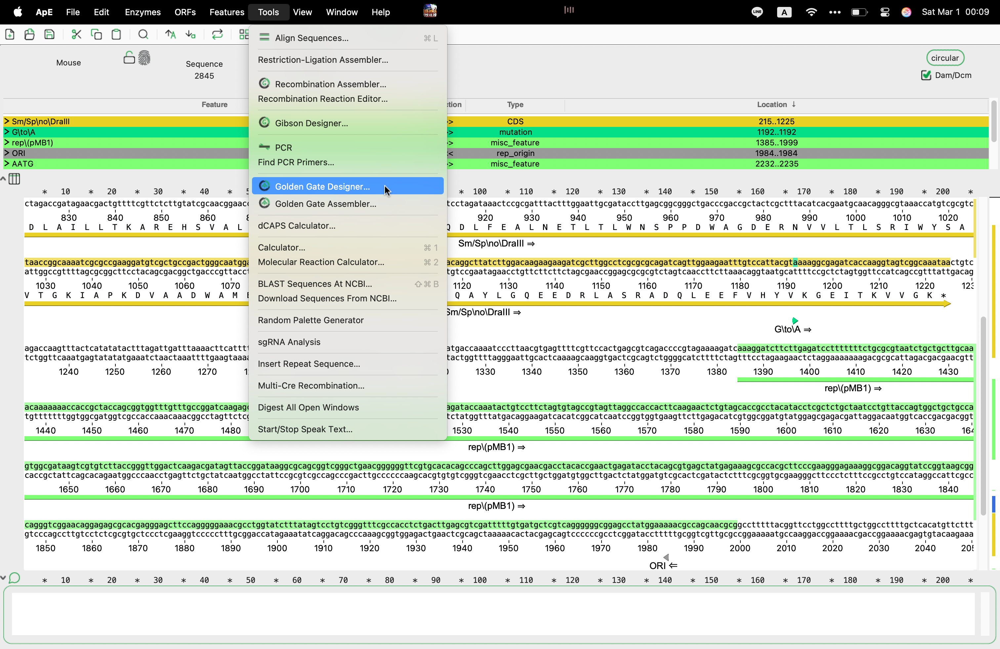
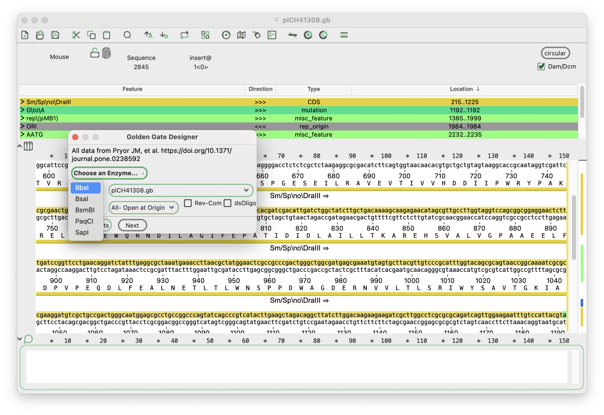
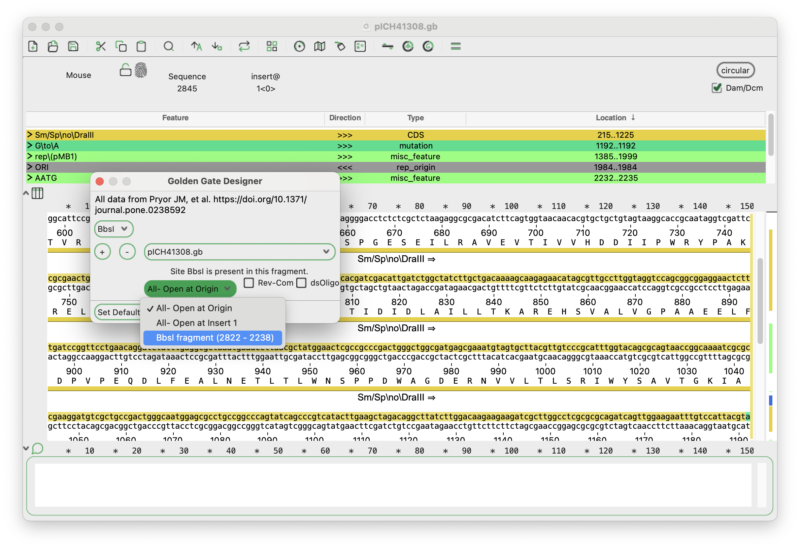
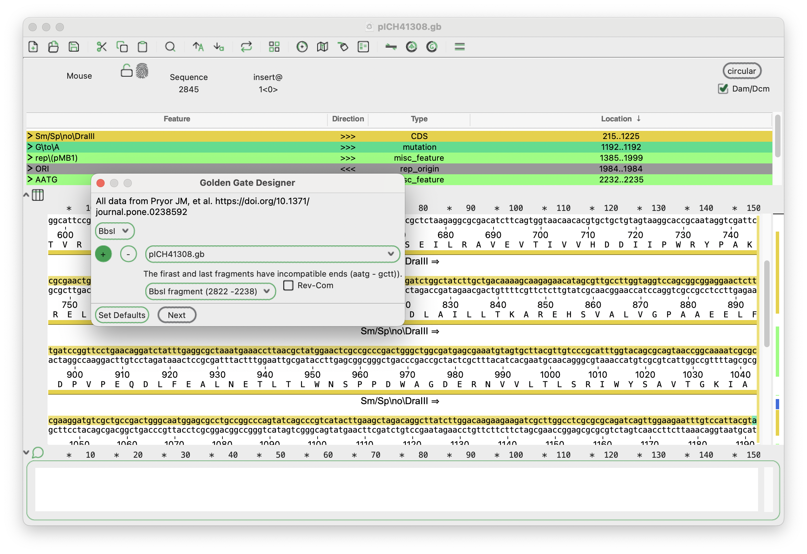
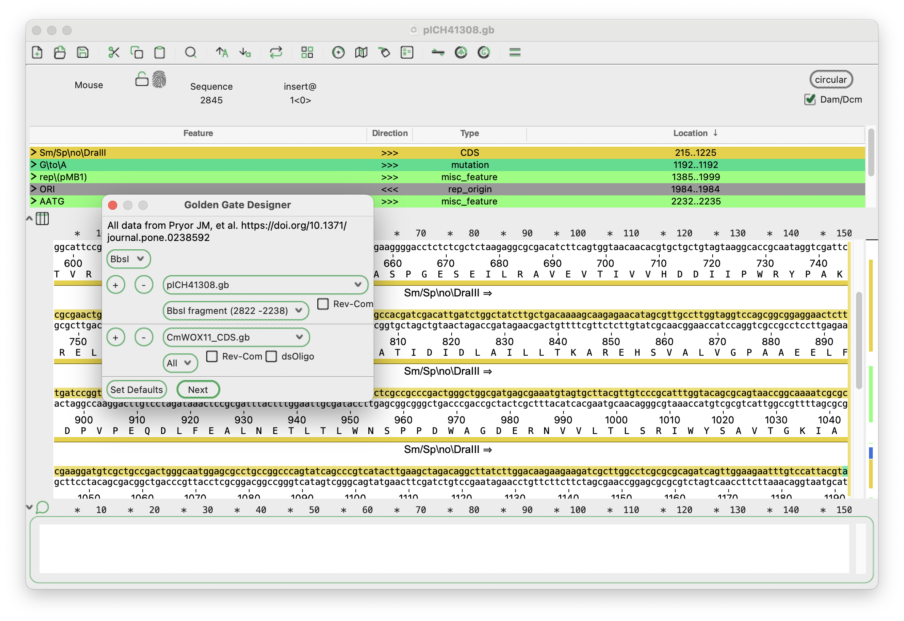
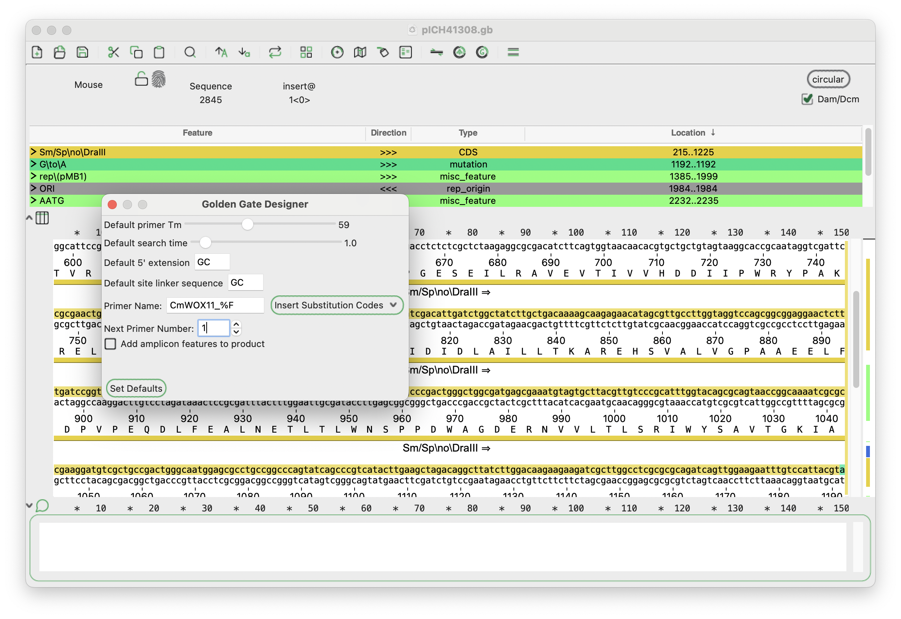
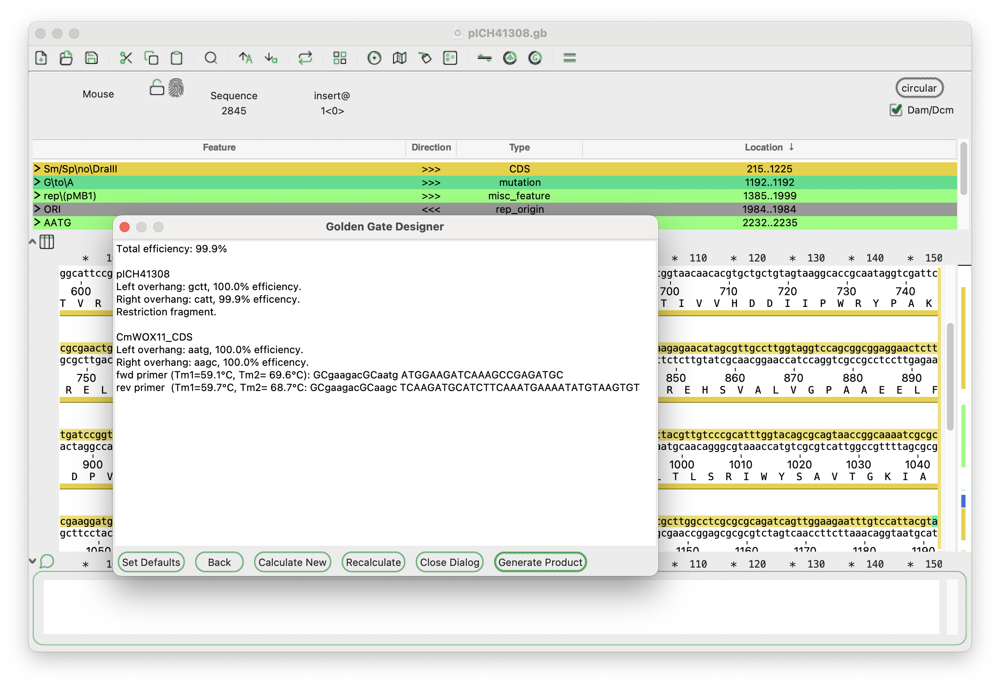
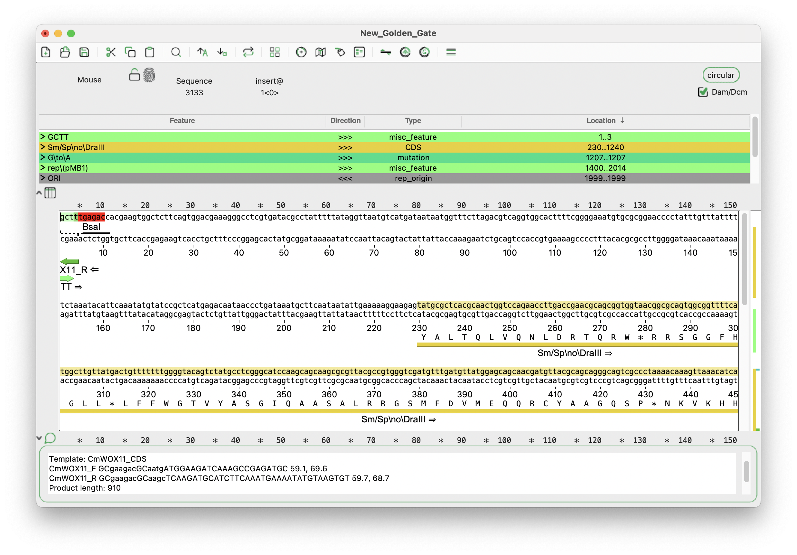
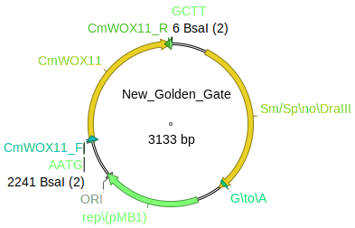

## Golden Gate Designer

### 1. Clone new modules into Lv0 Acceptor

| Fragment Name | Position       | 5' Overhang | 3' Overhang | Description                             |
|---------------|----------------|-------------|-------------|-----------------------------------------|
| [CmWOX11_CDS](../Genbank%20file/CmWOX11_CDS.gb) | plant CDS    | -           | -           | WOX11 CDS from *Citrus medica*          |
| [pICH41308](../Genbank%20file/pICH41308.gb)   | Lv0 CDS Acceptor | AATG       | GCTT       | Lv0 Acceptor for clone new CDS module   |

1. Open the two Genbank files with ApE.

2. Verify and domesticate the sequences (CmWOX11) if presence of Type IIS restriction enzyme site.

    !!! note "For MoClo system, remove BsaI and BbsI site."

3. Design the primers for amplification. Click "Tool"->"Golden Gate Designer"

4. Choose target Type IIS restriction enzyme for design (BbsI).

    !!! note "BbsI for Lv0 and Lv2 Acceptor; BsaI for Lv1 Acceptor."

5. Choose pICH41308 Lv0 Acceptor vector for cloning, and select BbsI fragment

6. Add "+" the new fragment (CmWOX11) to the cloning design.

7. (Optional) Click "Set Defaults" to change primer parameters.

    !!! note "Two nucleotides "GC" is enough for 5' extension to help BsaI and BbsI binding"

8. Click "Next" to generate the primer sequences for the cloning.

    

9. Review the primer sequences and make any necessary adjustments. Click "Generate Product" to create final construct.

    

    !!! note "Primer information is listed in the comment section"

    
 

10. Save the primer sequences and proceed with the [cloning experiment](../../../Molecular-Cloning/Golden-Gate-Cloning.md).
