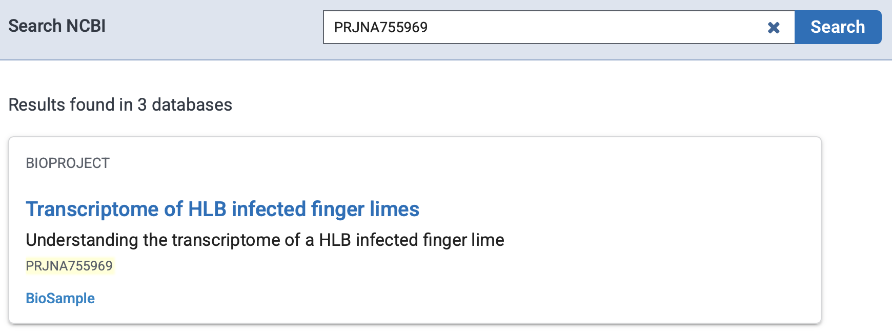
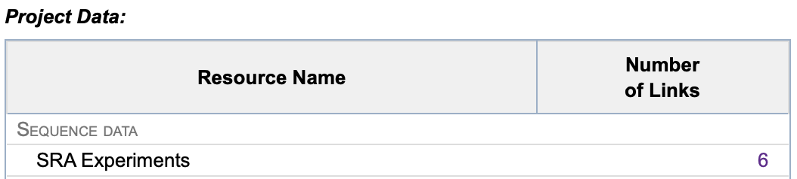
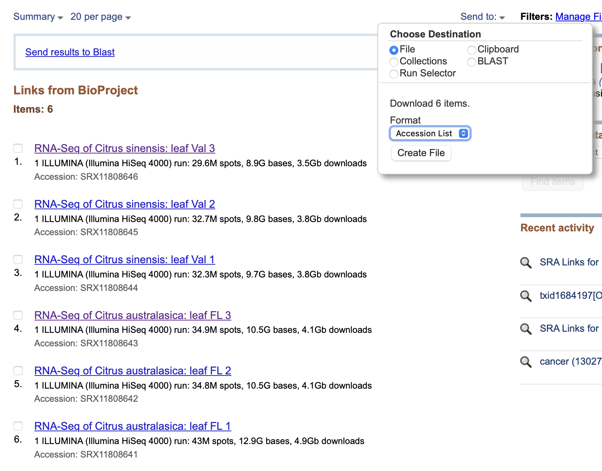

# **RNAseq Workflow**

## **1. Login to HPRC System**

1. Open Terminal.
2. Connect to the HPRC system:
    ```bash
    ssh NETID@faster.hprc.tamu.edu
    ```
3. Enter your password when prompted.

---

## **2. Operate Under the Scratch Folder**

1. Change to your scratch directory:
    ```bash
    cd /scratch/user/NETID
    ```
2. Create and navigate to the `RNAseq` directory:
    ```bash
    mkdir RNAseq
    cd RNAseq
    ```
3. Create and navigate to the `fastq` directory:
    ```bash
    mkdir fastq
    cd fastq
    ```

---

## **3. Download SRA Files from NCBI**

1. Create a text file named `sra_list.txt`:
    ```bash
    nano sra_list.txt
    ```
2. Copy and paste the SRA accession list (e.g., from NCBI BioProject):
    ```
    SRR10356225
    SRR10356226
    SRR10356227
    SRR10356228
    SRR10356229
    SRR10356230
    ```
3. Save the file (`Ctrl+X`, then `Y`, and `Enter`).

### **Example**
- **BioProject Accession Number**: `PRJNA755969`

#### **Retrieve SRA Accession List**
1. Search the BioProject Accession Number on NCBI.  
    
2. Check the SRA Experiments files.  
    
3. Download the SRA Accession List using the "Send to" option.  
    

---

## **4. Submit a Slurm Job to Download and Compress SRA Files**

1. Create a Slurm script named `SRA_download_gzip.sh`:
    ```bash
    nano SRA_download_gzip.sh
    ```
2. Add the following content to the script:
    ```bash
    #!/bin/bash
    #SBATCH --job-name=dl_and_gzip_sra
    #SBATCH --output=dl_and_gzip_sra_%A_%a.out
    #SBATCH --error=dl_and_gzip_sra_%A_%a.err
    #SBATCH --array=0-5
    #SBATCH --time=06:00:00
    #SBATCH --mem=16G
    #SBATCH --cpus-per-task=8
    #SBATCH --ntasks=1
    #SBATCH --partition=cpu
    #SBATCH --mail-user=NETID@tamu.edu
    #SBATCH --mail-type=ALL  

    ml load GCC/13.2.0 OpenMPI/4.1.6 SRA-Toolkit/3.1.1 pigz/2.8 WebProxy

    SRA_ID=$(sed -n "$((SLURM_ARRAY_TASK_ID+1))p" /scratch/user/NETID/RNAseq/fastq/sra_list.txt)
    OUTDIR=/scratch/user/NETID/RNAseq/fastq
    mkdir -p ${OUTDIR}

    cd ${OUTDIR}

    fasterq-dump ${SRA_ID} --split-files --threads 8 --mem 14G -O ${OUTDIR}
    pigz -p 8 ${SRA_ID}_*.fastq
    ```
3. Save the script (`Ctrl+X`, then `Y`, and `Enter`).

4. Submit the Slurm job:
    ```bash
    sbatch SRA_download_gzip.sh
    ```

---

## **5. Download Reference Genome FASTA and GTF Annotation Files**

1. Navigate to the `RNAseq` directory:
    ```bash
    cd /scratch/user/NETID/RNAseq
    ```
2. Create and navigate to the `genome_reference` directory:
    ```bash
    mkdir genome_reference
    cd genome_reference
    ```
3. Download the reference genome FASTA and GTF annotation files using `wget`:
    ```bash
    wget <website URL>
    ```
4. If only a GFF3 file is provided, convert it to a GTF file:
    ```bash
    module load GCCcore/12.3.0 gffread/0.12.7
    gffread NAME.gff3 -T -o NAME.gtf
    ```

---

## **6. Prepare Samplesheet**

1. Navigate to the `RNAseq` directory:
    ```bash
    cd /scratch/user/NETID/RNAseq
    ```
2. Create a `samplesheet.csv` file:
    ```bash
    nano samplesheet.csv
    ```
3. Add the following content:
    ```
    sample,fastq_1,fastq_2,strandedness
    SRR10356225,/scratch/user/NETID/RNAseq/fastq/SRR10356225_1.fastq.gz,/scratch/user/NETID/RNAseq/fastq/SRR10356225_2.fastq.gz,unstranded
    SRR10356226,/scratch/user/NETID/RNAseq/fastq/SRR10356226_1.fastq.gz,/scratch/user/NETID/RNAseq/fastq/SRR10356226_2.fastq.gz,unstranded
    SRR10356227,/scratch/user/NETID/RNAseq/fastq/SRR10356227_1.fastq.gz,/scratch/user/NETID/RNAseq/fastq/SRR10356227_2.fastq.gz,unstranded
    SRR10356228,/scratch/user/NETID/RNAseq/fastq/SRR10356228_1.fastq.gz,/scratch/user/NETID/RNAseq/fastq/SRR10356228_2.fastq.gz,unstranded
    SRR10356229,/scratch/user/NETID/RNAseq/fastq/SRR10356229_1.fastq.gz,/scratch/user/NETID/RNAseq/fastq/SRR10356229_2.fastq.gz,unstranded
    SRR10356230,/scratch/user/NETID/RNAseq/fastq/SRR10356230_1.fastq.gz,/scratch/user/NETID/RNAseq/fastq/SRR10356230_2.fastq.gz,unstranded
    ```

---

## **7. Prepare Nextflow Script**

1. Navigate to the `RNAseq` directory:
    ```bash
    cd /scratch/user/NETID/RNAseq
    ```
2. Create a Nextflow script:
    ```bash
    nano nextflow_run.sh
    ```
3. Add the following content:
    ```bash
    #!/bin/bash
    #SBATCH --job-name=nfcore_rnaseq
    #SBATCH --cpus-per-task=16
    #SBATCH --mem=128G
    #SBATCH --time=24:00:00
    #SBATCH --nodes=1
    #SBATCH --partition=cpu
    #SBATCH --output=/scratch/user/NETID/RNAseq/logs/nfcore_rnaseq.out
    #SBATCH --error=/scratch/user/NETID/RNAseq/logs/nfcore_rnaseq.err
    #SBATCH --mail-user=NETID@tamu.edu
    #SBATCH --mail-type=ALL  

    cd $SCRATCH
    module load WebProxy
    module load Nextflow/24.10.3

    export SINGULARITY_CACHEDIR=$TMPDIR/.singularity

    nextflow run nf-core/rnaseq -r 3.18.0 -profile singularity \
      --input /scratch/user/NETID/RNAseq/samplesheet.csv \
      --fasta /scratch/user/NETID/RNAseq/genome_reference/NAME.fa \
      --gtf /scratch/user/NETID/RNAseq/genome_reference/NAME.gtf \
      --outdir /scratch/user/NETID/RNAseq/results \
      --pseudo_aligner salmon \
      --skip_bbsplit \
      -resume
    ```
4. Save the script (`Ctrl+X`, then `Y`, and `Enter`).

5. Submit the Slurm job:
    ```bash
    sbatch nextflow_run.sh
    ``` 
---

### **Directory Structure**
```
/scratch/user/NETID/RNAseq/
├── fastq/
│   ├── sample1_1.fastq.gz
│   ├── sample1_2.fastq.gz
│   └── ...
├── genome_reference/
│   ├── NAME.fa
│   ├── NAME.gtf
├── samplesheet.csv
└── results/
```